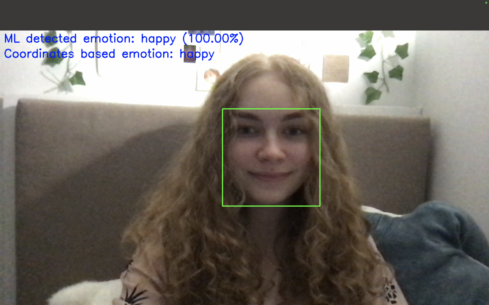

# Recognizing_lie
В этом проекте реализована система распознавания эмоций с использованием данных о чертах лица и нейронных сетей. Она включает в себя сценарии для обучения модели нейронной сети, обработки данных и выполнения логического вывода для прогнозирования эмоций по изображениям лиц. В будущем, проект будет распознавать, лжет ли человек или нет по эмоции, которую он показал. 

### Подготовка проекта
1) Клонирование репозитория
```
git clone https://github.com/SofiaGots/Recognizing_lie_and_emotions
```
2) Открытие папки
```
cd Recognizing_lie_and_emotions
```
3) Установка нужных библиотек
```
pip install -r requirements.txt
```
4) Готово!

### Ориентация по проекту (выполнять следующие файлы по порядку, чтобы модель могла обучиться и выполнить задание):

1) **Recognizing_lie/src/collect_from_picture.py** - файл, загружающий координаты точек лица с показанной эмоцией на картинке в отдельный файл (в файле хранятся данные для обучения модели распознавать эмоции) - подготовка dataset

2) **Recognizing_lie/src/train_model.py** - файл, благодаря которому программа обучается распознавать эмоцию (можно заметить, что в результате программа выдает, с какой точностью была определена та или инная эмоция, и с каждым разом эта точность растет (модель обучается)) - обучение модели

3) **Recognizing_lie/src/use_model_camera.py** - файл, который используется для распознавания эмоций (так как модель уже обучена, она может распознавать, на какая эмоция изображена сейчас) - оценка изображения

### Процесс работы над задачей:
Моей первоначальной идеей было распознавание лжи при помощи написанных мной функций (я хотела рассмотреть несколько случаев из интернета, когда понятно, что человек лжет по точкам на лице), но данное желание оказалось невыполнимым (или же я просто не нашла правильного подхода), так как на написание собственных функций влияют огромное количество факторов, таких как освещение, поворот головы, насколько близко находится лицо и многое другое. Также, к сожалению, даже после огромного количества попыток, я не смогла придумать универсального способа распознавания гнева. После этого, я посоветовалась с Натальей Владимировной и решила, что первым шагом для достижения моей цели может быть распознавание эмоций. Не удивительно, но и эта задача имела такие же проблемы. Тогда я спросила у своего папы, как можно решить данную проблему, так как мне очень понравилась идея моего проекта и менять его я совсем не хотела. Тогда папа предложил немного изучить встроенные модели из библиотек, чтобы модель обучалась на фотографиях (я ей даю фотографии, говорю, что на них изображена, например, грусть, и она запоминает это для последующих исследований). Первоначально, у нас ничего не получалось из-за того, как мы выяснили позднее, что было слишком маленькое разрешение фотографий. С каждым разом, вероятность распознавания эмоций была все выше, и я поняла, что это напрямую зависит от количества фотографий с разными лицами, для этого я попросила своих друзей скинуть мне свои фотографии с данными 4 эмоциями для улучшения качества работы модели. Я считаю, что сейчас моя модель обучена очень хорошо, ведь практически во всех случаях (в том числа в темноте или же с поворотом головы) она выдает верную эмоцию. Я оставила также мою первоначальную версию проекта (которая была только с функциями), чтобы можно было сравнить два данных результата.

### Итоговый результат


### Статус проекта

Первоначальная идея проекта заключалась в распознавании лжи человека, но так как я не знала, как обучать встроенные модели, то первоначально я хотела осуществить данный проект при помощи точек на лице (тогда мой проект содержал бы только вывод ответа "Coordinates based emotion"). Я решила начать не с распознавания лжи, а с распознавания основных эмоций (нейтральная, радость, злость, грусть) и поняла, что это далеко не эффективный способ. Тогда я стала изучать технику использования встроенных моделей и поняла, что разобраться с ними очень тяжело, но работать в дальшейшем гораздо легче. Сейчас мой проект находится на стадии осуществления только части задуманного, но в ближайшее время, я планирую улучшить его и достичь первоначальной цели (придумать способы распознавания лжи, а также для уже созданного проекта, увеличить количество эмоций)! 
